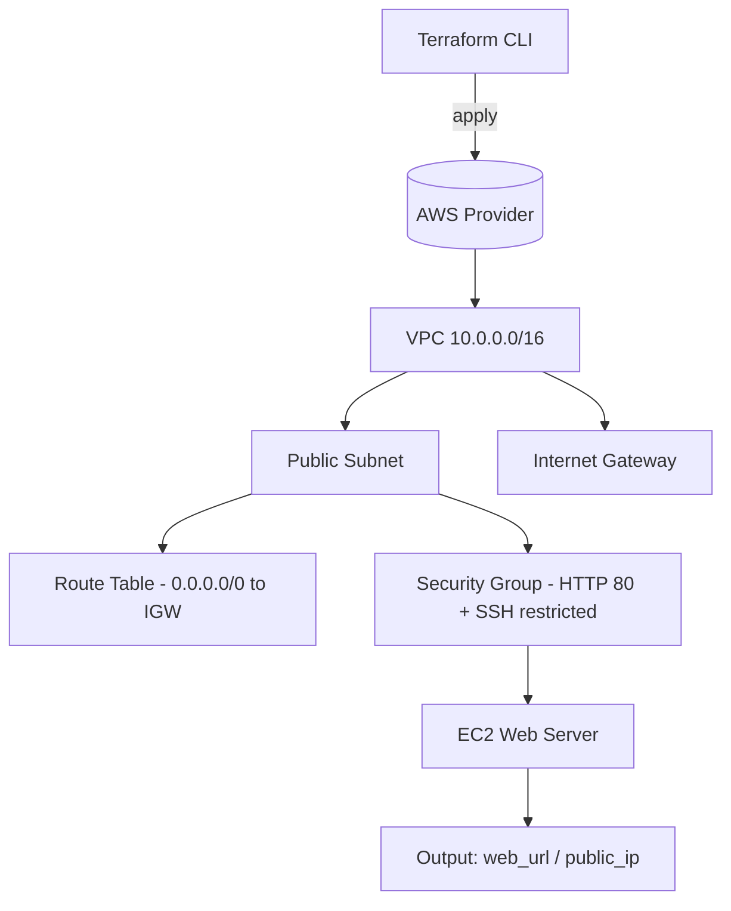

# Architecture — Terraform AWS Infrastructure

Infrastructure as Code with Terraform: a VPC with a public subnet and an EC2 web server, all provisioned declaratively.

## How it works

- Terraform declaratively provisions a VPC, public subnet, Internet Gateway and route table.
- A Security Group allows HTTP from anywhere and SSH only from a restricted CIDR.
- An EC2 instance is launched as a web server and its public IP / URL is exposed as an output.
- The entire stack is reproducible with terraform apply and fully removable with terraform destroy.
